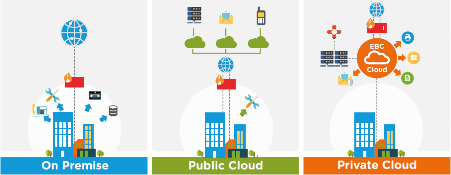
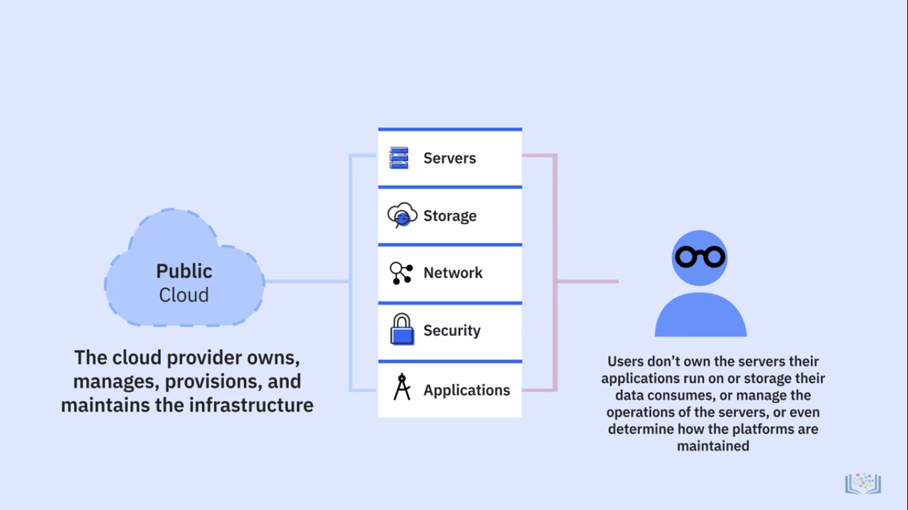
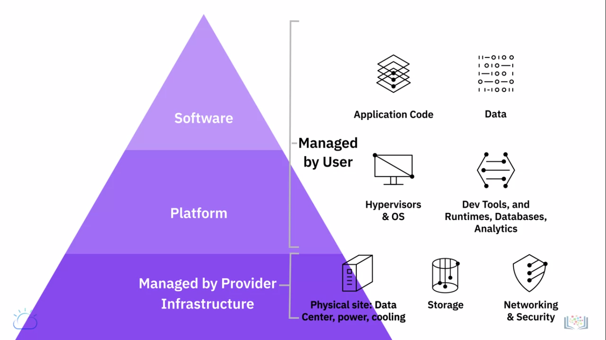
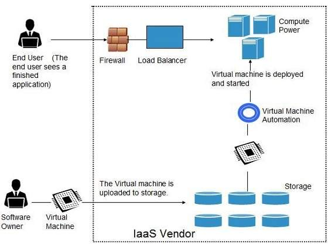
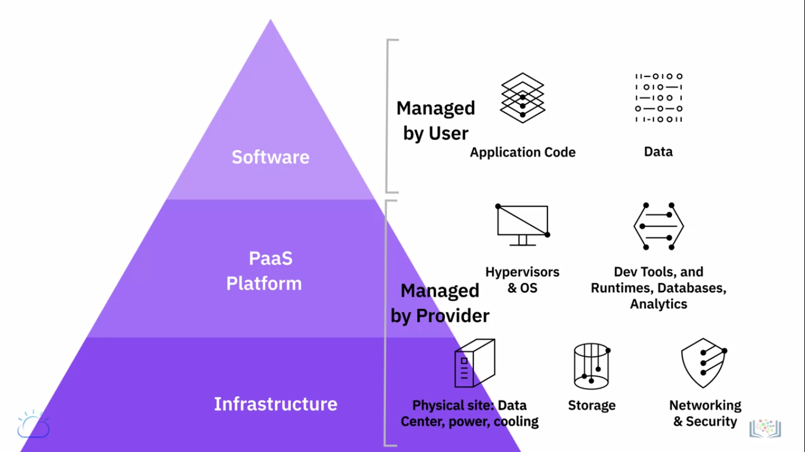

# CLOUD MODELS

## Deployment Models

Deployment models indicate where the infrastructure resides, who owns and manages it , how cloud resources and services are made available to users .

### On Premise (self managed)

On-premise deployment is when data is stored on your own servers, and you install and manage the software. An on-premise software infrastructure means that all the software is stored on your hardware on your company's premises. This requires your company's IT department to maintain the infrastructure on their own.
It is also known as `private cloud`

### Public Cloud

The public cloud makes it possible for anybody to access systems and services. The public cloud is one in which cloud infrastructure services are provided over the internet to the general people or major industry groups. The infrastructure in this cloud model is owned by the entity that delivers the cloud services, not by the consumer.

In a public cloud model, users get access to **servers, storage, network, security and application** as services delivered by cloud service providers over the internet.

### Hybrid Cloud 

 With a hybrid solution, you may host the app in a safe environment while taking advantage of the public cloud’s cost savings. Organizations can move data and applications between different clouds using a combination of two or more cloud deployment methods, depending on their needs. 

 ## Service Models

 

 ### IAAS (Infrastructure as a Service)

 It is a form of cloud computing that delivers fundamentals : 
 **Compute     Network    Storage** to consumers `on demand, over the internet, on a pay-as-you-go` basis.

 The cloud provider hosts the infrastructure computation traditionally present in an On-Premises data center as well as the virtualisation or hypervisor layer.

 Hypervisor
 :software that creates and manages a virtual machine on a host machine

 In an IaaS cloud environment, customers can create or provision Virtual Machines in their choice of region & zone available from cloud provider.

- Virtual Machines comes pre installed in customers choice of operating system in which customers can then deploy middleware, Install application & run workloads on these VM's.

- Storage has backups and workloads which tracks and monitors the performance & usage for disaster recovery.

#### Key components of Cloud Infrastructure

1. Physical Data Centers
    - Physical machines : power the various layers of abstraction on top of them
2. Compute
    - compute
    - memory 
    - storage
3. Network
    - virtualization
    - API's
4. Storage 
    - object : most common mode as it is Highly distributed and resilient
    - file
    - block

### PAAS (Platform as a Service)

A cloud computing model that provides a complete application platform to 
  - develop
  - deploy
  - run
  - manage

PaaS providers Host and manages :
- Servers
- Networks 
- Storage
- Operating System
- Application Runtime
- API
- Middleware
- Databases

It also takes responsibility for Installation, Configuration, Operation of application Infrastructure. 

### SAAS (Software as a Service)

SaaS provides access to users to a service provider’s cloud-based software. Users simply access the applications on Cloud while the Cloud provider maintains the infrastructure, platform, data, application code, security, availability, and performance of the application.

### STAAS (Storage as a Service)

Storage as a Service (STaaS) is the practice of using public cloud storage resources to store your data. Using STaaS is more cost efficient than building private storage infrastructure, especially when you can match data types to cloud storage offerings.

Storage as a Service or STaaS is cloud storage that you rent from a Cloud Service Provider (CSP) and that provides basic ways to access that storage.

Cloud Storage
: where you save data and files in cloud.

- certain storage must be attached to **compute node** before storage can be accessed
- whereas other storage types can be directly accessed through **public/private** network connection

Cloud Providers 
1. Host 
2. Secure
3. Manage
4. Maintain 
cloud storage and associated infrastructure to ensure you have accesss to your data when you need it

Cloud storage is available in four main types - Direct Attached, File Storage, Block Storage and Object Storage.

  1. Direct Attached [local storage]
  : storage which is directly presented in cloud-based server & is effectively either within the same host server or rack . It is FAST . used to store server's operating system . It's disadvantage is that it is Temporary (only lasts as long at the compute resources it's attached to) and it cannot be shared with other nodes too.

  2. File Storage
  : presented to compute nodes as 'NFS storage' . NFS - network file storage and it means that the storage is connected to compute nodes over a standard ethernet network.
  It is less expensive , More resilient to failure and Less disk management , maintenance for you as the user to do and Provision much larger amounts of storage as compared to Direct attached storage 

  3. Block Storage
  : presented as volume to compute nodes  using high speed fibre connections. Block storage breaks files into chunks of data . stores each block separately under a unique address. Must be attached to a comute node before it can be utilized . Not suitable for shared storage between multiple servers.

  For block storage, as it is for file storage, we need to take IOPS capacity of the storage into account.

  4. Object Storage
  : it isn't attached to compute node rather it is accessed via an API . it is cheapest but slow compared to other traditional storage types like file and block storage. It is good for large amounts of unstructured data.
  - used to store files-or objects - which are static.
  - cannot run os or other applications such as databases using object storage.
  - Objects are stored in Buckets. You can have multiple buckets, but you cannot place buckets within buckets
  - no need to specify a size for a bucket, you can just use as little or as much as u need as it is infinite in size
  

