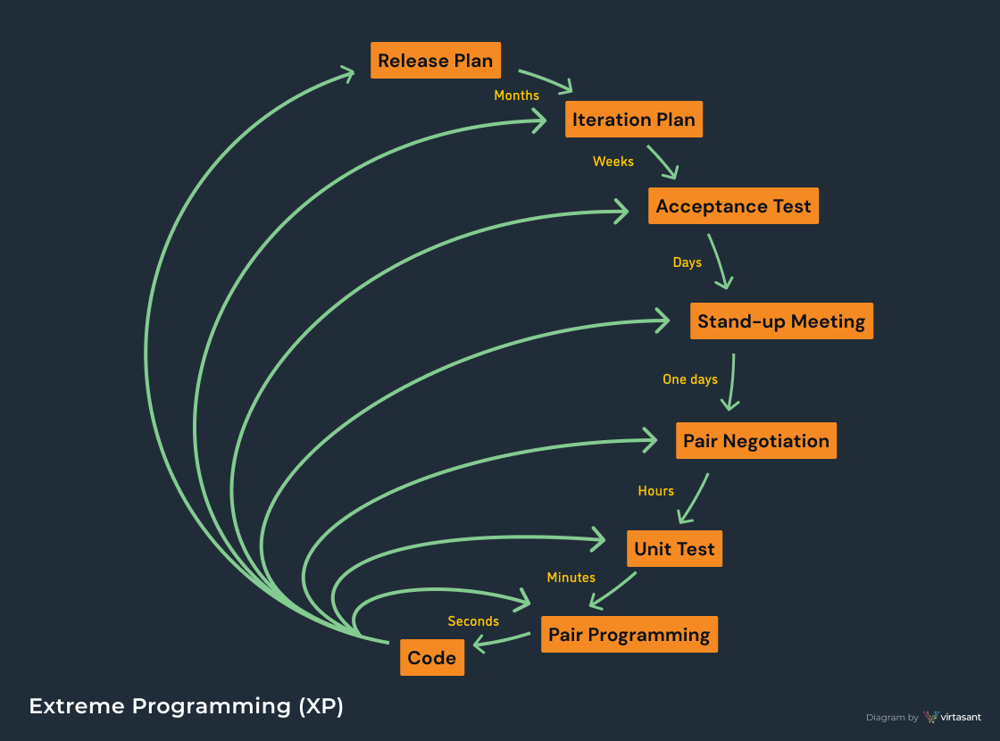
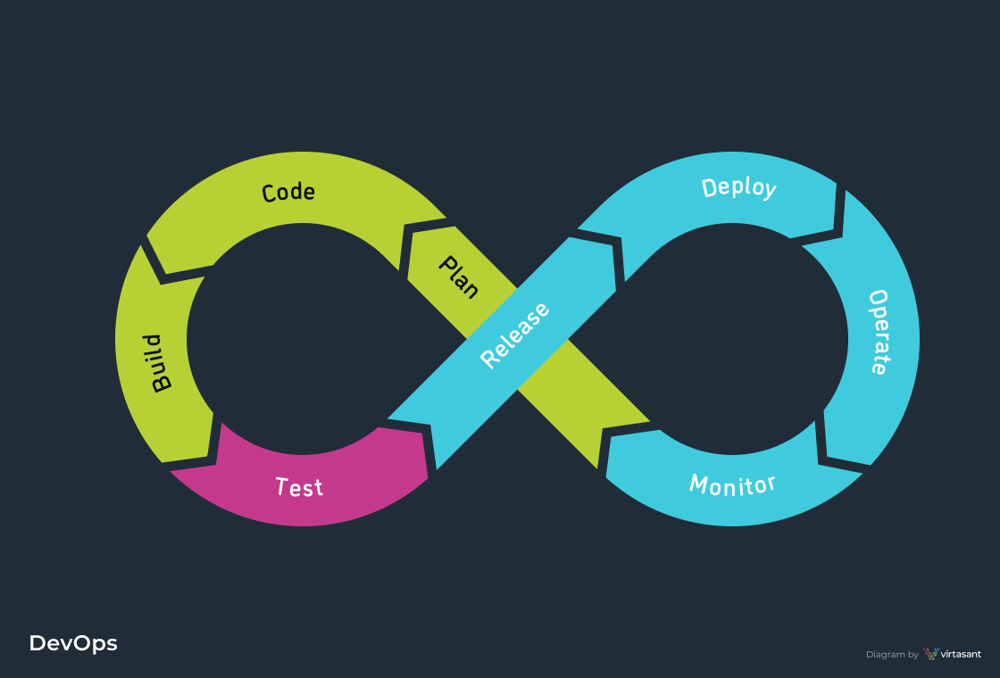

# SDLC (Software Development Process Models)

## Waterfall Model

According to the Waterfall method, the software development process goes through all the SDLC phases with no overlapping and consists of a single development cycle. According to the fact that it is a linear-sequential life cycle model, any phase in the development process can begin only if the previous one is complete. Teams are large and everyone on the team (business analysts, architects, developers, tests, operations, etc.) all work within their own silos.

## Prototype Model

The Prototype method revolves around the creation of a low fidelity prototype for the purposes of collecting early feedback from prospective users. From there, prototypes are evolved into final software requirements.

## Iterative Model

With the Iterative Model, only the major requirements are known from the beginning. Based on these, the development team creates a quick and cheap first version of the software. Then, as additional requirements are identified, additional iterations of the software are designed and built.  Each iteration goes through all the phases of the SDLC and these cycles are repeated until completion. It was common for the team to work on several SDLC phases at the same time.

## AGILE

Agile is the mainstream methodology used in modern software development, and expands its influence beyond coding into many aspects of product development, from ideation to customer experience.

The Agile methodology breaks a project down into multiple cycles, each passing through some or all of the SDLC phases. The focus is on people and how they work together to get the project done. Agile calls for continuous collaboration between team members and stakeholders with regular cycles of feedback and iteration.

The Agile Manifesto’s 4 Core Values
 1. Individuals and interactions over processes and tools
 2. Working software over comprehensive documentation
 3. Customer collaboration over contract negotiation
 4. Responding to change over following a plan

## XP (Extreme Programming)

Extreme Programming (XP) is an Agile framework focused on project flexibility and writing high quality, well-tested code. The official Extreme Programming website states that XP improves a software project in 5 key ways:

- Communication
- Simplicity
- Feedback
- Respect
- Courage

## DevOps

DevOps brings deployment and operation of the software fully into the Agile development process in the same way Agile brought testing and business analysis into software development. Ultimately, the team is empowered to be self-sufficient and take ownership of software development, shipping, and support. They use Continuous Delivery (CD) for frequent releases and to maintain a well-tested and high-quality codebase.

